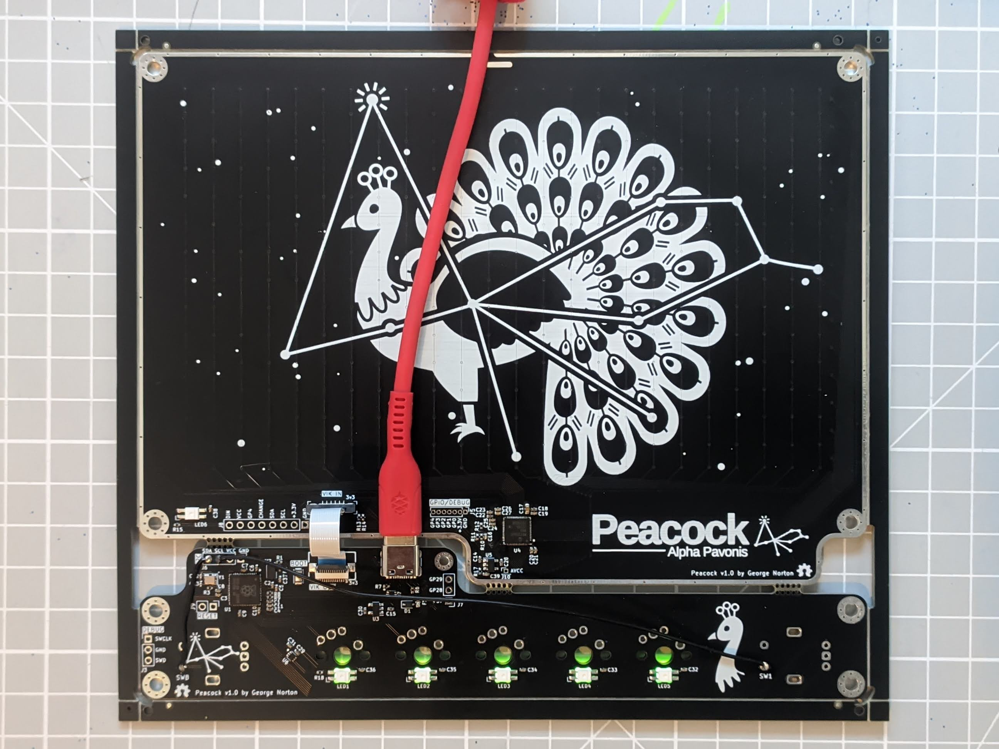
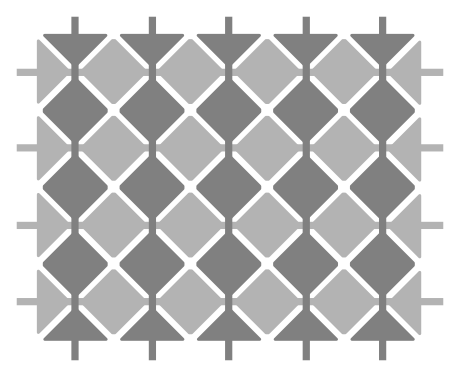
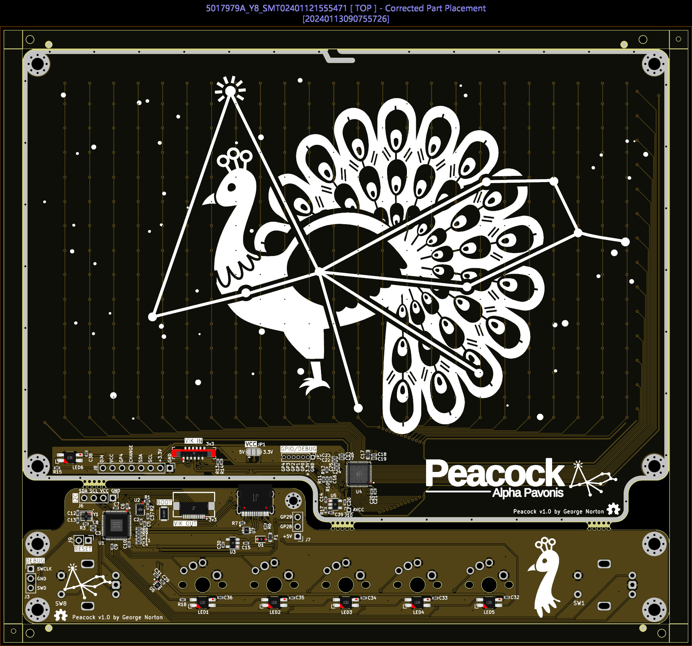
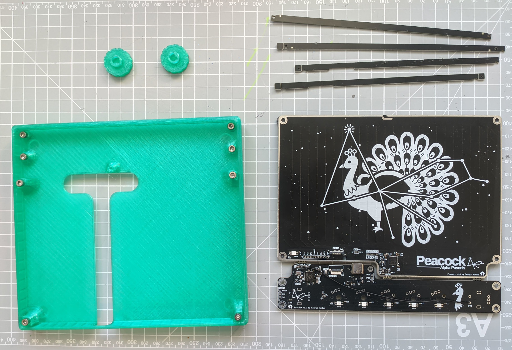
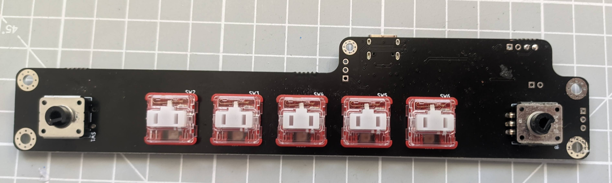
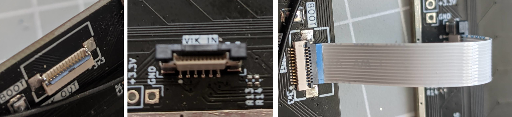
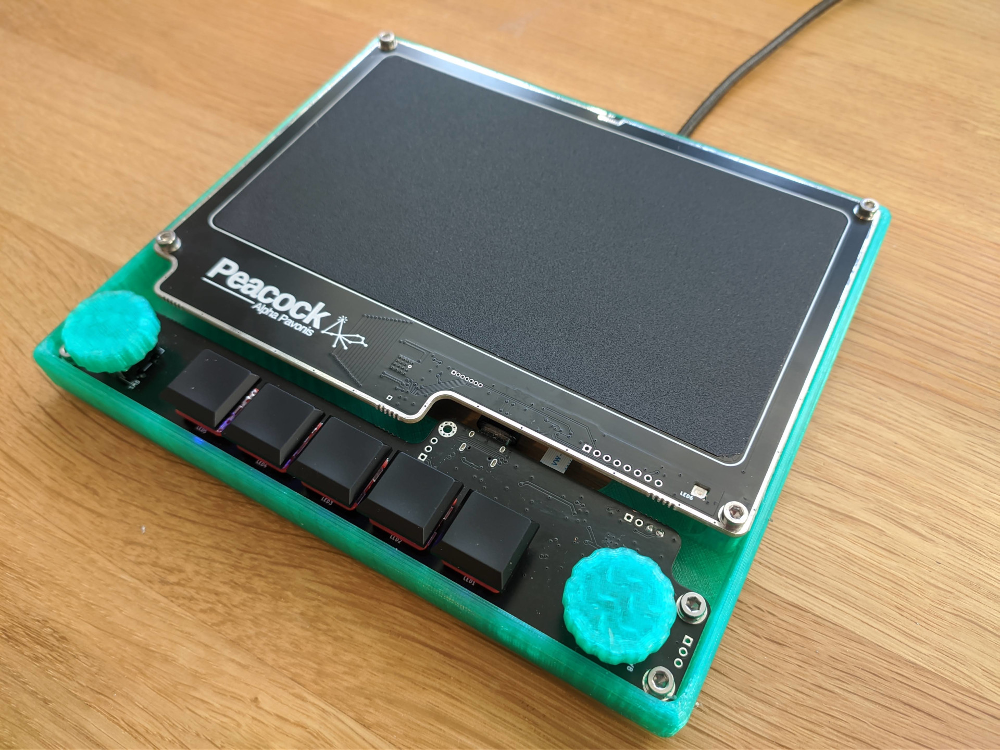

# Peacock

Peacock is an RP2040 powered trackpad running QMK. It features an integrated Microchip MaxTouch sensor IC which is
connected to a 7" capacitive sensor.

## Features
- Fully PCBA, this other than switches and encoders, this board is designed to be fully factory assembled.
- Integrated RP2040 controller, no need to a separate controller.
- 7 inch 16:9 capacitive sensor.
- 5 Choc/MX switches and 2 EC11/EC12 encoders.
- A [VIK](https://github.com/sadekbaroudi/vik) connection between the controller and sensor board.

## But how does it work?
The capacitive sensing IC is wired to a grid of diamond shaped electrodes. The diamonds are connected to form rows and columns. The IC scans the matrix by
applying a small voltage to the rows in turn, and then measuring voltage on the columns. Any conductive objects nearby (like your finger) will distrupt the
electrical field and can be detected.

## Sensor capabilities
The mXT336UD-MAU002 sensor IC used in this design is in fact a touchscreen controller rather than a trackpad controller. I have chosen to use a touchscreen
controller as they tend to be designed for much larger sensor areas than touchpad controller. This sensor can:
- Detect 10 concurrent touch events.
- Can support both mutual capacitance and self capacitance measurements.
- Has integrated signal processing capabilities to reduce noise, reject large touches (grip or palms) etc..
- Can be configured as a digitizer, or an array of up to 16 buttons.
- The sensor also supports a passive stylus, although the electrodes in Peacock are larger than the recommended size, so this may not perform well.

## Software support
Currently there are two QMK branches with peacock support.

The [first](https://github.com/george-norton/qmk_firmware/tree/peacock) implements support for the maxtouch IC as a pointing device - this is how the current
trackpads (cirque, Azoteq) work. as well as pointer movement,
the MaxTouch QMK driver will detect the following gestures:
- Tap to click (1 finger for mouse button 1, 2 fingers for mouse button 2 etc..)
- Two finger scroll.
- Tap and hold to drag.

The [second](https://github.com/george-norton/qmk_firmware/tree/multitouch_experiment) exteneds the digitizer feature to implement real trackpad support. On this
branch, the MaxTouch driver reports 5 separate finger positions to the host and it detects gestures. This provides a better experience as scrolling is smoother,
pinch and zoom are supported and most OS's provide additional 3 finger gestures which will work too. This branch still needs a lot of work, and it is a large changeset
which will likely take some time to get merged into QMK.

## Sensor tuning
The sensor sensitivity may require tuning depending on the type of surface you use on your build. This can be done by adjusting the touch threshold, and
if required the transmit gain. If your sensor is not detecting touches well, reduce the touch threshold. If your sensor is jittery, or is detecting spurious touches
increase the touch threshold, or if there is any ungrounded metal by the sensor, move it. Increasing the transmit gain will require a larger touch threshold, but it
should enable you to use thicker overlays and it will give you more room to adjust the touch threshold.

The gestures are implemented in software, they rely on various parameters that can be tuned by defining macros.

## BOM
To build a Peacock you will need:
- Factory assembled PCBs (from, for example JLCPCB).
- 5 Choc v1 or MX switches.
- 5 keycaps.
- 2 Encoders (ec11/ec12).
- 2 Encoder knobs.
- 1 Type-A 12P 0.5 mm pitch FFC cable (ideally around 5cm long) [aliexpress](https://www.aliexpress.com/item/1005004140412156.html).
- [A 3D printed case](case/) and its mounting fixtures.
- Some sort of nice feeling insulating surface to put over the sensor, for example sticky vinyl wrap or acrylic. Ideally this should not have any air gaps, so FDM printed surfaces should be printed with 100% infill. If the surface is too thin the trackpad will not perform well, multiple layers of vinyl may be required.
- 4 rubber bumpons.

## PCB ordering guide
Use the gerbers files in the releases, most options are not critical although a thicker PCB is probably best so it does not flex too much when you press against the sensor.
I have tested with 1.6mm thickness, lead free HASL from JLCPCB.

The sensor IC is not available from LCSC, you will need to use JLCPCB's global parts sourcing service to order chips from Digikey, the digikey part number is 150-ATMXT336UD-MAU002-ND, expect a lead time of 1-2 weeks. You may also find the flash memory and LED parts go in and out of stock, so it might also be worth preordering those. The LEDs are optional, if the are not available you can always hand solder some at a later time.

You can see the correct part orientation here, when ordering ensure that all parts are correctly rotated:

The v1.0 release has been tested and it works, but there is an issue with the I2C pin allocation. As a result it requires two additional bodge wires, and the encoder switches will not work.

The v1.01 release has the issue fixed. It is untested, but expected to work.

## Assembly guide

Assembly is simple as the majority of the work is done by the manufacturer. You will need to:

- Remove the edge rails by breaking them off with a pair of pliers, then cut or break the mousebites to separate the two PCBs.

- Test your PCB. Plug it in and hopefully you will see a new mass storage device. Drag and drop a firmware (uf2) file to flash it. If sucessfull, the LEDs should light up.
- Solder 5 MX/Choc switches.
- Solder 2 EC11/EC12 encoders.

- Connect both boards together using the FFC cable, the black parts of the connector can be opened to enable you to insert the cable.

- Use a thread tapping tool to create threads in the case.
- Place the boards into the case.
- Screw it in with 8xM3 6mm screws and optionally 1xM2 6mm screw near the USB port.
- Stick your surface to the sensor area. The surface is critical to the performance of the trackpad, without a surface you will likley get no movement at all. Depending on its thickness, a single piece of vinyl will likely be insufficient for the trackpad to track well, a two or three layers will work much better. I noticed that some battery powered USB hosts require additional surface thickness to track multiple fingers well.

If you build a Peacock, please post a picture in the [show and tell](https://github.com/george-norton/peacock/discussions/categories/show-and-tell).

## Firmware
Peacock support has not yet been merged back to QMK. You can find a branch with pointing device support [here](https://github.com/george-norton/qmk_firmware/tree/peacock) or the multitouch branch [here](https://github.com/george-norton/qmk_firmware/tree/multitouch_experiment) Note, this branch currently does not work with MacOS.

## VIK support
This trackpad is a VIK device, so you should be able to discard the controller portion of the build and wire the trackpad directly to a different VIK enabled controller (such as those sold by fingerpunch and splitkb). You could also replace the controller board with one of your own design.
